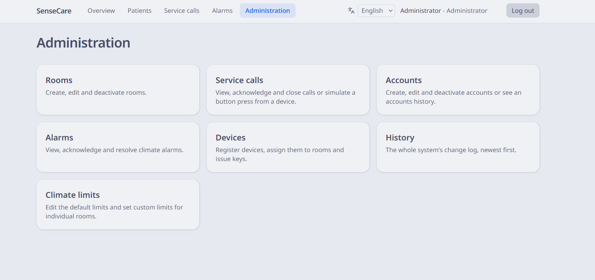
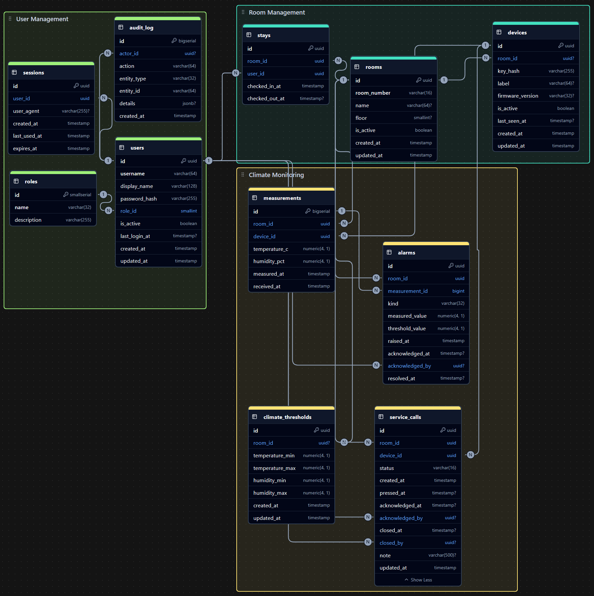

<h1 align="center">SenseCare</h1>
<h3 align="center">━━━━━━━━━  ❖  ━━━━━━━━━</h3>

<p align="center">IoT platform for indoor climate monitoring and service calls in hospital rooms.</p>

<!-- BADGES -->
<div align="center">

[](https://github.com/zelvios/sensecare/actions/workflows/ci.yml)
[](https://github.com/zelvios/sensecare/blob/main/LICENSE)

[](https://github.com/zelvios/sensecare/issues)
[](https://github.com/zelvios/sensecare/commits/main)
[](https://github.com/zelvios/sensecare)

</div>

## Showcase

<p align="center">
  
</p>

<p align="center">
  
</p>

## Contents

- [Stack](#stack)
- [Repository layout](#repository-layout)
- [How to work on it](#how-to-work-on-it)
- [Quick start](#quick-start)
- [Tests](#tests)
- [Contributing](#contributing)
- [Windows 11 notes](#windows-11-notes)

## Stack

- Rust API (axum, Diesel with diesel-async)
- SvelteKit frontend (Svelte 5, Tailwind CSS)
- PostgreSQL 16
- ESP32 room nodes
- Docker Compose

## Repository layout

```
sensecare/
├── backend/              Rust API, see backend/README.md
├── frontend/             SvelteKit app, see frontend/README.md
├── firmware/             ESP32 room node code, see firmware/README.md
├── docs/                 Architecture, schema, acceptance tests
├── scripts/dev.ps1       Command shortcuts for Docker Compose
├── .github/workflows/    CI and PR checks
├── docker-compose.yml    db + api + web
├── .env.example          Template for .env
├── .gitattributes        Line ending rules
└── .editorconfig         Editor formatting rules
```

## How to work on it

| Working on     | Run                                                        |
|----------------|------------------------------------------------------------|
| Backend        | `docker compose up -d db`, then `cargo run` in `backend/`  |
| Frontend       | `docker compose up -d db api`, then `pnpm dev` in `frontend/` |
| Everything     | `.\scripts\dev.ps1 up`                                     |
| Firmware       | `docker compose up -d db api` and point the node at your PC's IP |

Native runs read `backend/.env` and `frontend/.env`. Docker reads the root `.env`.
Each has an `.env.example` next to it.

After changing the API while the frontend is running against Docker:
`docker compose up -d --build api`.

## Quick start

```powershell
git clone https://github.com/zelvios/sensecare sensecare
cd sensecare
Copy-Item .env.example .env       # then set POSTGRES_PASSWORD
.\scripts\dev.ps1 up
```

| Service | URL                                    |
|---------|----------------------------------------|
| Web     | http://localhost:3000                  |
| API     | http://localhost:8080/swagger-ui       |
| Health  | http://localhost:8080/health           |
| DB      | localhost:5433 (dev only, user sensecare) |

The first start creates an `admin` account with the password from
`BOOTSTRAP_ADMIN_PASSWORD` in `.env`.

## Tests

**Backend**
```powershell
cd backend
cargo nextest run                  # unit + integration, needs the db container
cargo nextest run --test acceptance
```
**Frontend**
```powershell
cd frontend
pnpm test                          # Playwright, needs db and api containers
```

## Contributing

Every change goes through a pull request into `main`. Branches are named
`type/short-description` (Conventional Branch), commits follow Conventional Commits,
and PRs are rebase-merged. CI runs fmt, clippy and the test suite against a real Postgres.

## Windows 11 notes

- **Toolchain**: WSL 2 + Docker Desktop (WSL 2 engine), Git for Windows, rustup with
  Visual Studio Build Tools (C++ workload), Node 22 LTS, pnpm.
- **Diesel CLI**: install the prebuilt binary rather than compiling it:
  `irm https://github.com/diesel-rs/diesel/releases/latest/download/diesel_cli-installer.ps1 | iex`
- **Smart App Control** blocks freshly compiled Rust build scripts with
  `os error 4551`. Turn it off under Windows Security > App & browser control, or
  develop inside WSL 2.
